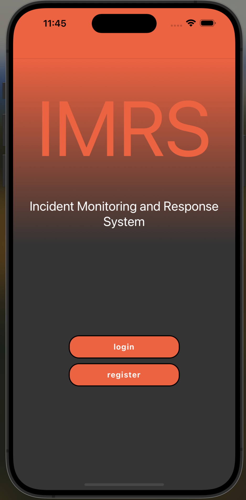
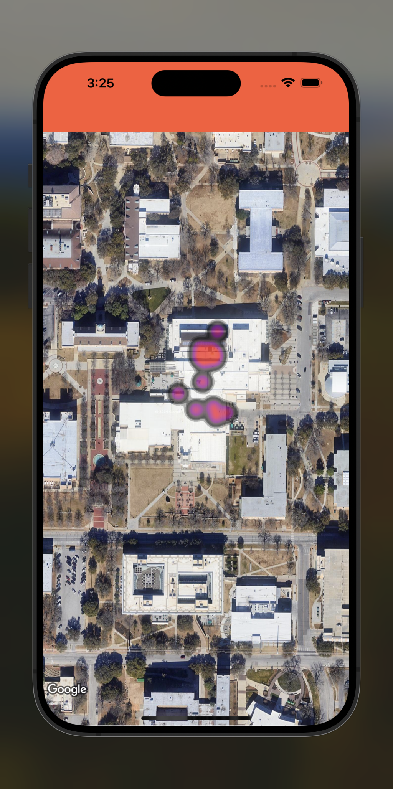

# LifeShield: Active Shooter Alert & Response App



***

The purpose of the document is to explain how the IMRS application will run, and how to run it on your own device. IMRS is an application meant to assist first responders in a school shooter situation. It will allow users to display their statuses on a heat map that will be shown to first responders. F.R. 's can use this information to determine the general location of the shooter in the building, and allow them to subdue the threat quickly and save as many lives as possible.

***

## Key Features

- **Real-Time Heat Maps:** Visualize hotspots where danger is most concentrated using heat maps updated in real-time.
- **Immediate Alerts:** Receive instant notifications if an active shooter is reported near you.
- **Safety Navigation:** Guided navigation to the nearest exits or designated safe zones.
- **Emergency Contacts:** Quick access to contact emergency services or notify loved ones of your status.




## Build Setup

### MacOS

1. Clone then cd in to the project.
2. Cd in to the ios directory and run `pod install`.
3. In appdeligate.mm file add the following code as shown below ``[GMSServices provideAPIKey:@"_YOUR_API_KEY_"]; // add this line using the api key obtained from Google Console``.
```
+ #import <GoogleMaps/GoogleMaps.h>

@implementation AppDelegate
...

(BOOL)application:(UIApplication *)application didFinishLaunchingWithOptions:(NSDictionary *)launchOptions
{
+  [GMSServices provideAPIKey:@"_YOUR_API_KEY_"]; // add this line using the api key obtained from Google Console
...
```
4. Cd in to the ios dir and run ``pod install``.
5. Cd in to the project root and run ``npm install``.
6. Run the project with ``npx expo start``.

Note: You will need to select either IOS with "i" or Android with "a" or Web with "w" in the terminal after running the project.

***

*Currently not available on any App Store.*
- [Google Play Store](link_to_google_play)
- [Apple App Store](link_to_apple_store)

## Usage

### Student/Teacher
Students and faculty will be trained how to use the app in advance.
When a Geofence is activated on the app, they will be able to communicate their status of eirther "Cant see,
Cant hear," "Cant see, Can hear," "Cant see, Cant hear" the active shooter.
This gives valuable data to help first responses locate the shooter faster. 

### First Responders
First responders will be able to see the heat map of the building, and the status of the students and faculty. The heat map will show the general location of the shooter to help them determine the best course of action to take.

---


