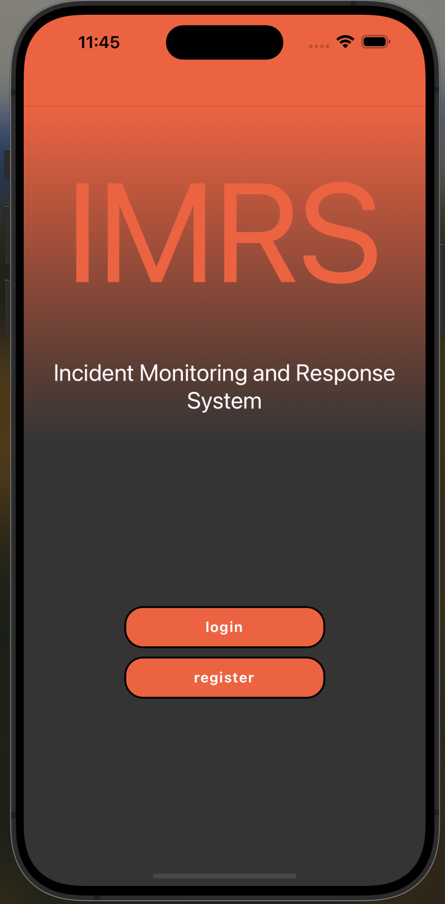

# IMRS-React-Native
***

  


# Description

Description goes here

# Installation

## Windows
***
Install Android Stuido
```bash
winget install -e --id Google.AndroidStudio
```
Launch Android Studio and update to the latest version.

In the Main Menu under Tools open the Device Manager and Create a Virtual Device (make sure it's a phone). Select an image that's on Android version 14

Remember to open Android Studio and start your Virtual Machine whenever you want to run IMRS on Android.


Create a [gihub personal acccess token](https://github.com/settings/tokens/new?description=IMRS%20GitHub%20plugin&scopes=repo%2Cgist%2Cread%3Aorg%2Cworkflow%2Cread%3Auser%2Cuser%3Aemail) (if needed) then clone the repository with one of the following for http and ssh respectively.

http

```bash
git clone https://github.com/Control-Shift-Create-Capstone-23-24/IMRS-React-Native.git
```

ssh

```bash
git clone git@github.com:Control-Shift-Create-Capstone-23-24/IMRS-React-Native.git
```

Inside the project directory, install npm packages

```bash
npm install
```

Add the Google Maps API Key. Instructions can be found in the "Google Maps API" Key section below.

## Mac
***


## Google Maps API Key
***

For a Google Maps api key (if needed). [Create an account](https://developers.google.com/maps/documentation/) then generate a Google Maps api key

### IOS (mac only)

To set up maps for IOS, edit the ./ios/reactNative/AppDelegate.mm file as with the following lines (the ones with pluses at the start of the line)

```diff
+ #import <GoogleMaps/GoogleMaps.h>

@implementation AppDelegate
...

(BOOL)application:(UIApplication *)application didFinishLaunchingWithOptions:(NSDictionary *)launchOptions
{
+  [GMSServices provideAPIKey:@"_YOUR_API_KEY_"]; // add this line using the api key obtained from Google Console
...
```

Edit the Podfile found at ./ios/reactIMRS/Podfile and add the following above the `use_native_modules!` function then run `pod install`.

```diff
rn_maps_path = '../node_modules/react-native-maps'
pod 'react-native-google-maps', :path => rn_maps_path
```


### Android

Run to generate the android directory.

```bash
npx expo run:android
```

Add the Google Map API Key to your AndroidManifest.xml file found at android/app/src/main/AndroidManifest.xml. Add your API Key to the file.

```diff
<application>
   <!-- You will only need to add this meta-data tag, but make sure it's a child of application -->
   <meta-data
     android:name="com.google.android.geo.API_KEY"
     android:value="Your Google maps API Key Here"/>
</application>
```


For a more detailed explanation look [here](https://github.com/react-native-maps/react-native-maps/blob/master/docs/installation.md).


